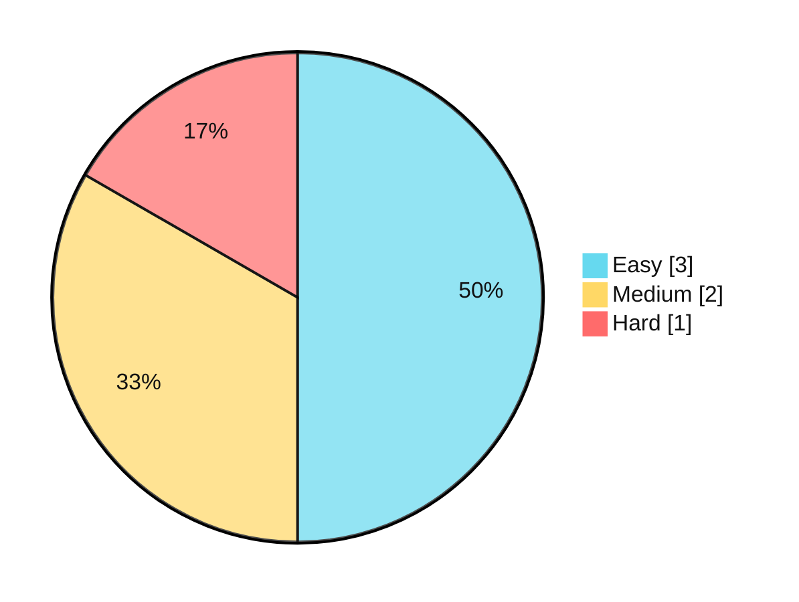

# LeetCode Journey

アルゴリズムとデータ構造の実装力を示すために、LeetCode の解答を難易度別に整理したポートフォリオリポジトリです。

## Progress

<!-- STATS:START -->
```text
LeetCode Progress
=================
Easy   : 0
Medium : 0
Hard   : 0
------------------------
Total  : 0
```


<!-- STATS:END -->

## Structure

- `easy/`: Easy 問題の解答
- `medium/`: Medium 問題の解答
- `hard/`: Hard 問題の解答
- `scripts/`: 統計更新スクリプト

## Add a Solution

1. 対応する難易度ディレクトリに解答ファイルを追加する（例: `easy/two_sum.py`）。
2. 問題名が分かるファイル名にする。
3. `main` への push 後、GitHub Actions が統計を自動更新する。
